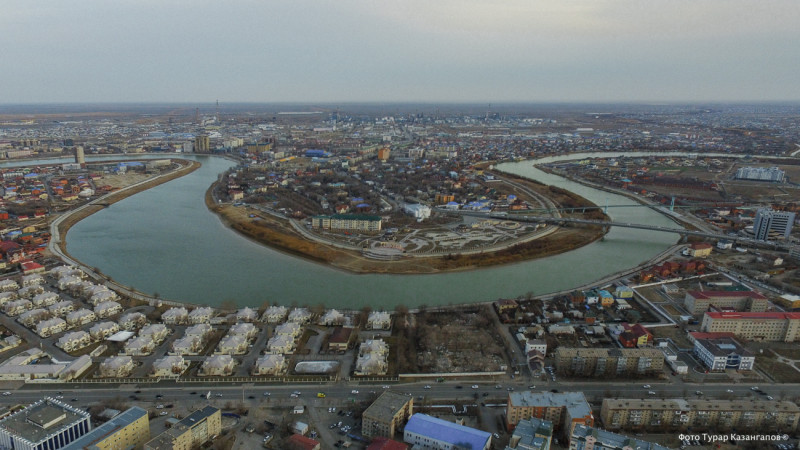

# nfactorial
1. tengri.html. tengri2.html две главные страницы, где style.css это стилизация этих двух страниц
2. page1,2,3,4,5,6.html страницы с детальной информацией статей и style2.css стилизация этих страниц.
3. Остальные фота были использованы для дизайна
4. Пагинация страниц в конце каждой страницы:
   

            <a href="tengri.html">&laquo;</a>
            <a  href="tengri.html">1</a>
            <a class="active" href="#">2</a>
            <a href="#">&raquo;</a>
          

            
5. Фильтрация делит новости на областные (Astana, Atyrau, Aktobe)
6. Поиск ищет новости по ключевым словам
7. JS был использован внутри кода, но сам код для фильтрации и поиска не корректно работает

<!DOCTYPE html>
<html lang="en">
<head>
    <meta charset="UTF-8">
    <meta name="viewport" content="width=device-width, initial-scale=1.0">
    <title>Tengri News </title>
    <link rel="stylesheet" href="style.css">
</head>
<body>
    <header>
        <h1>Tengri News</h1>
        <nav>
            <ul>
                <a class="header_tengri-rubrics_item news active" href="tengri.html">NEWS</a>
                <a class="header_tengri-rubrics_item life" href="/mixnews/">LIFE</a>
                <a class="header_tengri-rubrics_item sport" href="https://tengrisport.kz/">SPORT</a>
                <a class="header_tengri-rubrics_item travel" href="https://tengritravel.kz/">TRAVEL</a>
                <a class="header_tengri-rubrics_item guide" href="/tengriguide/">GUIDE</a>
                <a class="header_tengri-rubrics_item edu" href="/tengri-education/">EDU</a>
                <a class="header_tengri-rubrics_item auto" href="https://tengriauto.kz/">AUTO</a>
            </ul>
        
        </nav>
    </header>
    <main>
        <form id="searchForm">
            <input type="text" id="searchInput" placeholder="Search...">
            <button type="submit">Search</button>
        </form> 
        <nav id="categories">
            <button data-category="all" class="active btn" onclick="filterSelection('all')">All</button>
            <button data-category="news"  class="btn" onclick="filterSelection('Atyrau')">Atyrau</button>
            <button data-category="life"  class="btn" onclick="filterSelection('Astana')">Astana</button>
            <button data-category="sport"  class="btn" onclick="filterSelection('Aktobe')">Aktobe</button>
        </nav>
        <section id="news">
            

                <h1>Последние новости</h1>
                

                    

                        

                            
                            <h2>Материальный резерв разбронирован: спецтехнику направили в пострадавшие регионы</h2>
                            
                                Сегодня  21:41 
                    
                        
                            
                            
                        
                        
                            
                            
                        
                        
                        

                        

                            
                            <h2>Уровень перелива на водохранилище в СКО стремительно приближается к историческому максимуму</h2>
                            
Текст новости 2

                            
                                Сегодня  20:40 
                    
                        
                            
                            
                        
                        
                            
                            
                        
                        
                        

                        

                            
                            <h2>Паводки в Казахстане: Генпрокуратура заявила о начатых расследованиях в 3 областях</h2>
                            
                                Сегодня  19:18 
                    
                        
                            
                            
                        
                        
                            
                            
                        
                     
                        

                    

                    

                        

                            
                            <h2>Паводки в Казахстане: что происходит на водохранилищах страны</h2>
                            
                                Сегодня 18:49 
                    
                        
                            
                            
                        
                        
                            
                            
                        
                       
                        

                        

                            
                            <h2>В Атырау объявят режим ЧС</h2>
                            
                                Сегодня 17:00
                    
                        
                            
                            
                        
                        
                            
                            
                        
                              
                        

                        

                            
                            <h2>Даю поручение разбронировать государственный материальный резерв - Токаев</h2>
                            
                                Сегодня 13:16
                    
                        
                            
                            
                        
                        
                            
                            
                             
                         
                    

                

            

        </section>
        

            <a href="#">&laquo;</a>
            <a class="active" href="#">1</a>
            <a href="tengri2.html">2</a>
            <a href="tengri2.html">&raquo;</a>
          

            
        
    </main>
    <footer>
        
&copy; 2024 Tengri News

    </footer>
    
</body>
</html>
